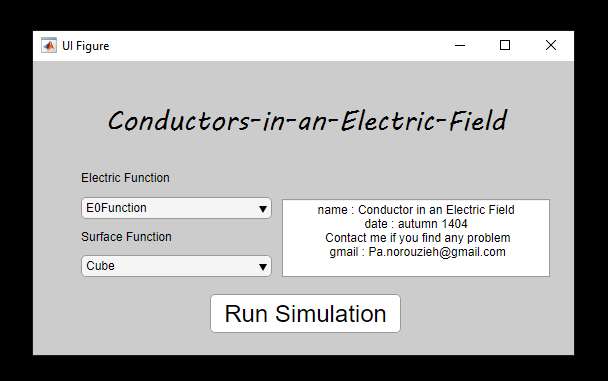
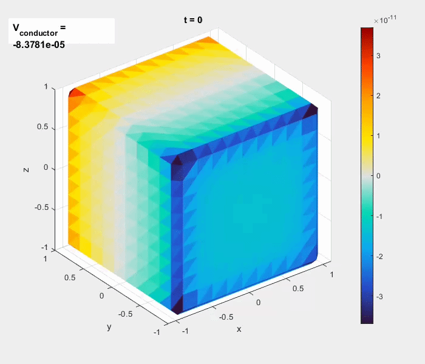
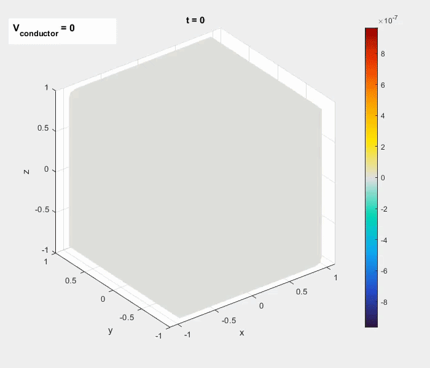

# ⚡ Conductors in an Electric Field


A **MATLAB-based numerical tool** for computing and visualizing the **surface charge density distribution** on **three-dimensional conducting bodies** under external electric fields.

The geometry of the conductor is defined using **implicit 3D functions** and converted to a **triangular mesh**. Users can define simple or complex shapes and subject them to various electric fields — uniform, position-dependent, or time-varying.

---

## 📖 Overview

This project provides a flexible computational framework for studying **electrostatic behavior** on arbitrary 3D conductors. It combines **boundary element methods** with **mesh generation** to solve for surface charge distribution and conductor potential.

### Key Capabilities
- **Custom Geometry Definition** — Define conductors using implicit functions (e.g., spheres, ellipsoids, tori)
- **Automatic Meshing** — Converts implicit surfaces to triangulated meshes
- **Flexible External Fields** — Supports uniform fields and arbitrary function handles for space/time-dependent fields
- **Charge Density Computation** — Calculates surface charge density σ(r) on the conductor
- **3D Visualization** — Renders charge distribution on the surface with color mapping
- **Time-Dependent Animation** — Animate time-varying charge distributions for dynamic field studies

### Target Applications
- Electrostatics studies and numerical experiments
- Investigating the effect of geometry on charge distribution
- Developing computational methods for electromagnetic problems
- Educational demonstrations of conductor behavior in electric fields

---

## 📸 Demo

### Interactive Application Interface



*App Designer interface for defining the conductor geometry, external field, and simulation parameters.*

### Animation — Charge Redistribution



*Time evolution of surface charge density under a time-varying external electric field.*

### Animation — Dynamic Field Response



*Real-time animation of charge redistribution as the conductor responds to a dynamic field.*

---

## 📐 Mathematical Background

The surface charge density σ(r) on a conductor is obtained by solving the **boundary integral equation** for the electric potential:

```
φ(r) = φ_ext(r) + ∫ G(r, r') σ(r') dS'
```

where:
- `φ_ext(r)` is the external potential from the applied field
- `G(r, r') = 1 / (4πε₀ |r - r'|)` is the free-space Green's function
- The integral is over the conductor surface `S`

The conductor surface is discretized into triangular elements, and the integral equation is solved numerically using the **Boundary Element Method (BEM)**.

---

## ✨ Features

| Feature | Description |
|---------|-------------|
| **Implicit Geometry** | Define conductors using algebraic functions (sphere, torus, etc.) |
| **Triangular Mesh** | Automatic conversion from implicit surfaces to surface mesh |
| **Uniform Fields** | Apply constant electric fields (e.g., `E = E₀ ẑ`) |
| **Custom Fields** | Define arbitrary fields via MATLAB function handles |
| **Time-Dependent** | Support for time-varying external fields |
| **3D Charge Plot** | Visualize σ(r) on the conductor surface with color mapping |
| **Animation** | Animate charge distribution over time |
| **Interactive GUI** | App Designer interface for easy parameter input |

---

## 🚀 Getting Started

### Prerequisites

- **MATLAB R2021a or later** (required for full App Designer and PDE Toolbox compatibility)
- **Required Toolboxes:**
  - **PDE Toolbox** — for mesh generation and `pdeplot3D`
  - **MATLAB App Designer** — built into MATLAB R2016a+

### Installation

1. **Clone the repository:**
```
git clone https://github.com/poyanorouzieh/Conductors-in-an-Electric-Field.git
cd Conductors-in-an-Electric-Field
```

2. **Add the project folder to MATLAB path:**
```
addpath('path/to/Conductors-in-an-Electric-Field');
savepath;  % optional — saves the path for future sessions
```

3. **Run the application:**
```
tutorialApp
```

---

## 🕹️ Usage

### Basic Workflow

1. **Define the conductor geometry** — Choose a predefined shape or provide a custom implicit function.
2. **Set the external field** — Select uniform, position-dependent, or time-varying.
3. **Run the simulation** — The tool computes σ(r) on the surface.
4. **Visualize results** — View the 3D charge density plot.
5. **Animate (optional)** — For time-dependent fields, animate the charge evolution.

### Example — Uniform Field on a Sphere

```
% Define the geometry (sphere of radius 1)
geom = @(x,y,z) x.^2 + y.^2 + z.^2 - 1;

% Define the external field (uniform along z)
E_field = @(x,y,z,t) [0; 0; 1];

% Run the simulation
results = runSimulation(geom, E_field);

% Plot the charge density
plotChargeDensity(results);
```

### Example — Time-Varying Field

```
% Time-dependent field (oscillating along x)
E_field = @(x,y,z,t) [sin(t); 0; 0];

% Animate over 10 seconds
animateChargeDistribution(geom, E_field, 0:0.1:10);
```

---

## 📂 Project Structure

```
Conductors-in-an-Electric-Field/
├── tutorialApp.mlapp        # Main interactive application (App Designer)
├── screenshots/             # Demo images and animations
│   ├── app_interface.png
│   ├── animation.gif
│   └── animation2.gif
├── .gitignore
├── LICENSE                  # MIT License
└── README.md                # This file
```

---

## 🛠️ Technologies Used

| Tool | Purpose |
|------|---------|
| **MATLAB** | Core computational environment |
| **PDE Toolbox** | Mesh generation and 3D surface plotting |
| **App Designer** | Interactive user interface |
| **Numerical Integration** | BEM for surface charge computation |

---

## 🧠 Technical Highlights

- **Boundary Element Method (BEM)** — Efficient surface-based solution avoiding volumetric meshing
- **Implicit Surface to Mesh** — Uses `isosurface` and `reducepatch` for mesh generation
- **Vectorized Computation** — Optimized MATLAB code using vectorized operations
- **Modular Design** — Separate functions for geometry, solving, and visualization
- **App Designer GUI** — User-friendly interface for non-programmers

---

## 🗺️ Future Work

- [ ] Add more predefined conductor shapes (cylinder, cone, torus)
- [ ] Support for multiple conductors with mutual interactions
- [ ] Add dielectric materials (not just perfect conductors)
- [ ] GPU acceleration for large meshes
- [ ] Export results to VTK for ParaView visualization
- [ ] Comprehensive documentation and tutorial scripts
- [ ] Unit tests for numerical solvers

---

## 📄 License

This project is licensed under the **MIT License** — see the [LICENSE](LICENSE) file for details.

---

## 👤 Author

**Poya Norouzieh**
- GitHub: [@poyanorouzieh](https://github.com/poyanorouzieh)
- Email: poyanorouzieh@gmail.com

---

⭐ **If you find this project interesting, feel free to star it!**